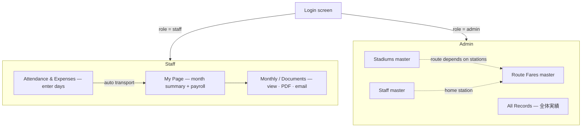

# User flow

One login screen. The account's role decides everything after it.

## Admin sets up the masters first (one-time)

The admin prepares the reference data the staff flow depends on:

1. **Stadiums** (`球場マスタ`) — name, address, **nearest station**.
2. **Staff** (`アルバイトマスタ`) — name, email, password, **home nearest station**, phone.
3. **Route Fares** (`区間別交通費`) — the one-way fare between a **home station ⇔ stadium station**
   (the admin looks this up in a transit app and enters it). This is what makes transport auto-calculate.

> Example from the sample: staff home = 円山, stadium = 大阪 → route fare ¥1,930 one-way.

## Staff: the everyday flow

1. **Log in** → lands on **My Page**: this month's work days, total hours, transport total, and net pay.
2. **Attendance & Expenses**: for each shift, enter **date, stadium, start, end, break**. On save:
   - worked time is computed automatically,
   - the **round-trip transport** for that stadium is auto-added (one-way fare × 2) and a toast shows
     the amount (e.g. "¥3,860 auto-applied"). No route registered → it says so, nothing is charged.
3. Repeat for the month. Days and expense lines are listed below the form; delete removes a day and
   its auto transport.
4. **Monthly / Documents**: view the three Asahi documents in-app, and:
   - **Print / Save as PDF** — always works (browser),
   - **PDF** — downloads a server-generated PDF (when Chromium is enabled),
   - **Email** — sends the document to your own address (when SMTP is configured; otherwise the send
     is simulated and reported as "captured").

## Admin: oversight

- **All Records** (`全体実績`): every staff member's monthly totals — work days, hours, salary,
  transport, tax, net — with a grand total row. Pick any month.
- **Accounts** (`アカウント管理`): create staff or admin accounts, change a user's role, reset a
  password, or delete — with guards so the last admin can't be removed and you can't delete yourself.
- The admin can open any staff member's documents too.

## Where the money is computed

Every figure — per-day wage, per-day withholding tax, transport, net pay — comes from **one tested
engine** (`shared/`). The API, the documents, and every screen call that same engine, so the numbers
on My Page, on the admin table, and on the printed 給料計算書 are always identical and always match
the client's real June documents to the yen.
